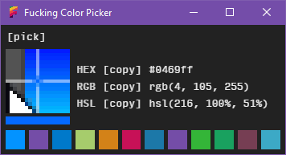

# Fucking Color Picker
### Because sometimes you just need a fucking color picker...

I built a new PC, and after years of Macness I was baffled to not find any sort of Windows equivalent of Digital Color Meter. That issue is now resolved. You're welcome.

## Issues

FCP is an [Electron](http://electron.atom.io) app, so be aware that (as is standard) it takes far too long to open. It also uses Electron's built-in screen recording module, which takes several seconds to fire up. This is the kind of thing I tend to keep open all day anyway, and this whole thing was hacked together in a day, so it's good enough for me. You also need to click and hold on the `[pick]` button, then release your mouse on the color you want to pick, due to limitations on accessing event handlers outside of the browser window. Otherwise, everything works beautifully.

## Downloads

So far I've just built it as a Windows portable app. I'll have multiplatform downloads in the releases section shortly.