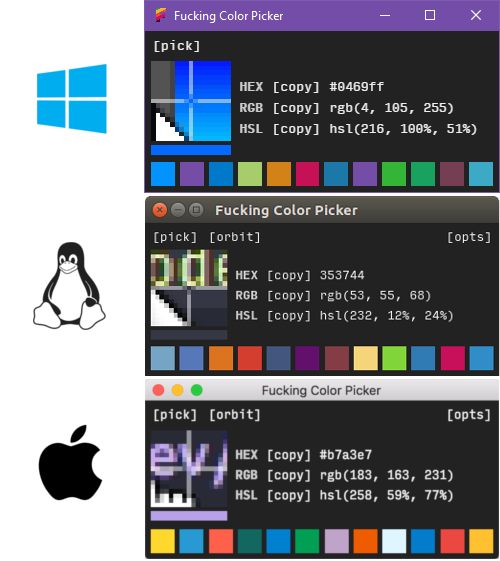
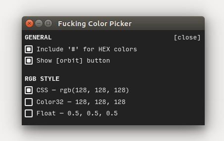
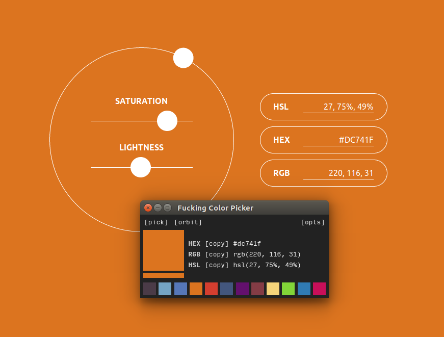

# Fucking Color Picker
### Because sometimes you just need a fucking color picker...

I built a new PC, and after years of Macness I was baffled to not find any sort of Windows equivalent of Digital Color Meter. That issue is now resolved. You're welcome.

## Downloads

Downloads are available at [tonymccoy.me/projects/orbit](http://www.tonymccoy.me/projects/orbit)

## Features

### Customizable Color Display

Colors come in CSS format by default since that's what I do all day, but there are a few additional options to tweak the display format in a few different ways I've seen it done in the wild.

### Open in Orbit

I also made this other thing called [Orbit](http://www.tonymccoy.me/orbit), which is a web-based tool for finding and tweaking colors. As FCP has no color alteration powers of its own, I find it helpful when the color you picked is close to but not exactly what you want. Just click the `[orbit]` button to open it and tweak to your heart's content. Or turn the button off in the `[opts]` menu if you don't like product tie-ins (open source though they may be).

## Issues

FCP is an [Electron](http://electron.atom.io) app, so be aware that (as is standard) it takes far too long to open. Fortunately, Chromium includes an easy to use screen capture method that essentially streams the screen to a buffer as a video, making it extremely easy to grab pixels and get their color. Unfortunately, the module takes several seconds to fire up on Windows and, unlike macOS's DigitalColor Meter the mouse shows up in the buffer. However, it works, and that's what's important. The meat of this thing was hacked together in a day, so it's good enough for me. You also need to click and hold on the `[pick]` button, then release your mouse on the color you want to pick, due to limitations on accessing event handlers outside of the browser window. Otherwise, everything works beautifully.